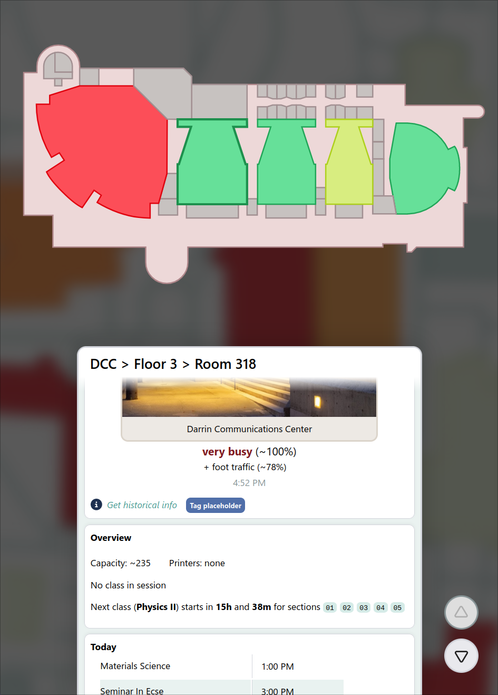

<h1 align="center">

 

[Vacansee](https://assets-global.website-files.com/6257adef93867e50d84d30e2/636e0a6918e57475a843f59f_icon_clyde_black_RGB.svg)

</h1>

### What is it?

**Vacansee** is an interactive (heat)map for displaying live stats on rooms/facilities @ RPI.

This includes:
- Expected building occupancy and foot traffic 
- Active/upcoming classes & where to find them
- Printer availability
- What dining halls are serving, and for how long
- —and more to come!

We intend to become the de facto one-stop-shop for event discovery, occupancy tracking, and general navigation on campus.	
</td><td>

 

<h6 align="center">

Made with ❤️ for [RCOS @ RPI](https://github.com/rcos)

</h6>
