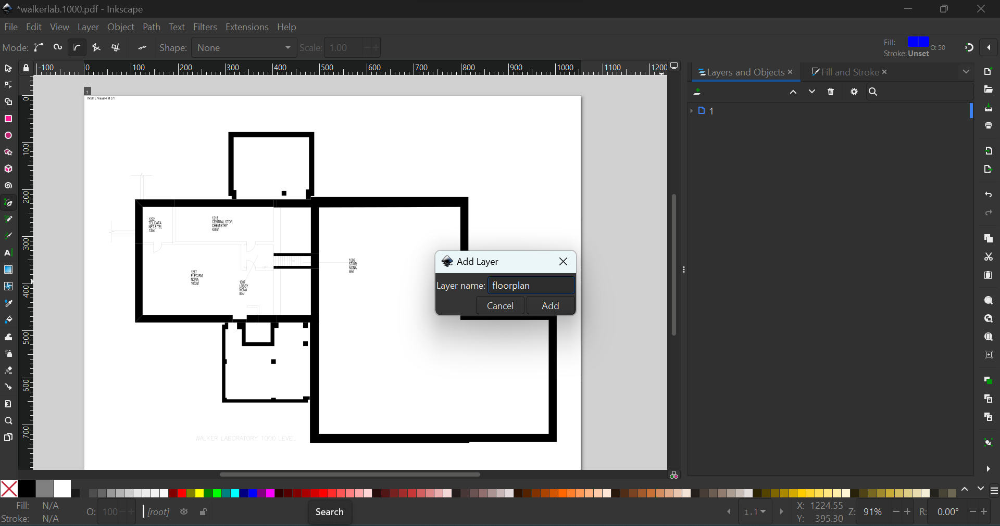
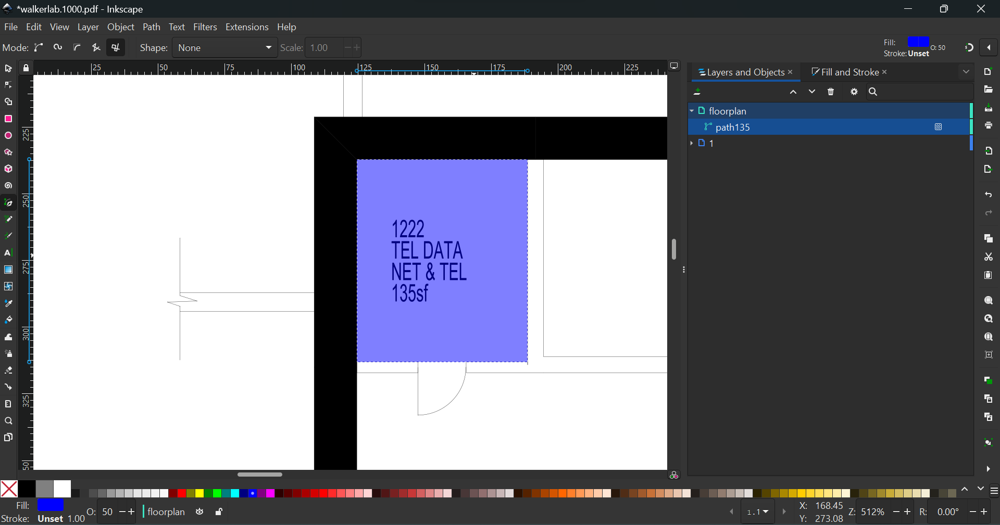

# Creating Floor Plans
We will be turning the floor plans into Scalable Vector Graphics (SVG) to allow for user interaction, css styling, and scalability. Before we create a floor plan, let us download one of the following programs:

**Free**
- [GIMP](https://www.gimp.org/)
- [Inkscape](https://inkscape.org/)

**Purchase**
- [Affinity Designer](https://affinity.serif.com/en-us/designer/)
- [Adobe Illustrator](https://helpx.adobe.com/illustrator/get-started.html)

For this tutorial, we will use Inkscape, but similar vector capabilities are provided in all programs listed. 

## 1. Obtain the floor plan
After choosing a building to work on, let us select a floor plan from these [QuACS PDFs](https://github.com/quacs/quacs-data/tree/5330bf53a2a553acfaee0ed7d03067b707464ce4/floor_plans). When choosing a floor, start with one that has the largest perimeter. By starting with the largest one, the following floors you create will be easier to align. It is best practice that one person finishes a whole building for design consistency.

## 2. Open the image
Launch your program, click on **'File'** from the menu, then select **'Open'**. Navigate to the location where your floor plan pdf is saved, select it, and click Open.

Now with the correct pdf open, we want to work towards an end goal of a floorplan svg with an approximate width of 3200px (taken from DCC floorplan to keep sizing and wall strokes in the app similar so that the floors don't look too different). To achieve this we will need to do some scaling, but this can be done either at the end of the floorplan or at the beginning. You have the option of scaling the image down first so that it is easier to work with and then scale it up, or you have the option of keeping the image the same size and scaling it up, or you can scale up immediately and then not have to worry about it later. I suggest trying out different methods for different floorplans and see what works best for you.

In order to scale the pdf or end svg, you will need to:
1. Go to `File` -> `Document Properties`. Press the chain looking icon next to the width/height to lock the scale to evenly enlargen it. Then increase the width dimension to the appropriate size to scale the document (note: this scales the document and not the contents of the document --> onto step 2)

2. Press `Ctrl-A` to select all svg elements, then with the cursor tool, hold `Ctrl`, grab the bottom right arrow, and scale evenly to the bottom right of the document size. You may want to play around with positioning of your contents in the document frame, as it seems a bit of empty space is good for displaying the svg in the app (otherwise a part of the svg may be cut off --> you will need to test out your svg in the app after completion and it may need some tweaking). A DCC floorplan silhouette example is shown below to help gauge spacing.

Here's an example of the DCC floorplan silhouette with a white background for the document (note: the floor and rooms are both black so they blend in with each other; the colors in the previous photo do not match what the colors mean in this photo, and the outer floor that is in white and the background that is transparent in the previous photo are black and white respectively in this image):

## 3. Trace inner rooms and outer floor
First, create a new layer to work on so that we are not directly editing the pdf layer (this will help us later when just exporting our traced floor).

Any room that is labeled with an id we will capture in the floor plan (stay away from capturing staircases). Use the pen tool (hold `Ctrl` to create 90 degree angles), zoom in on the first corner of a room and carefully select it.

I suggest watching [this video](https://www.youtube.com/watch?v=ijZlMHJJ0F0&ab_channel=LogosByNick) if you have a unique wall that you cannot trace with just right angles (curved walls, etc).

Do the same with the second corner, and from there Inkscape should only make perpendicular lines to the one you created, making it easy to finish up the room by clicking on the other corners and then finally connecting it to the first one.

If your room is now filled in black from the path, you can easily change the color to make it stand out and change the opacity on the bottom left of the screen. Then, press `Shift + Ctrl + X` (or go to `Edit -> XML Editor`) and rename the `id` tag to the room number preceded by a `_` (or if you are adding a room that needs a name instead of a room #, like the health center, write the name with `-`'s instead of spaces preceded by a `_`, like `_Health-Center`). FYI, just renaming the label (by double clicking the name and renaming it to `_308` for example) will add a tag called `inkscape_label` and not actually change the `id` tag that we need.

Some rooms don't have numbers but are essential in the foundation of the building or the shape of the floor. These rooms can be given the `id=unexcavated#` where `#` is replaced with an integer starting at 1 and increasing with every extra room of this kind (see `Sage1.svg` for example). Also, some floors in non-academic buildings that are unused for the average student (like the first floor of academy hall) can be simplified (especially if there are a lot of random office buildings). You can do this by utilizing the unexcavated ids to gray out that area, but make sure to leave empty space for hallways.

Tracing the outer floor is the VERY LAST step in the process of creating a floorplan after tracing all the inner rooms. To create the outer floor, you want to follow the path of the outermost inner rooms (tracing along their outer edge) while keeping in mind the shape of the building. Make sure to rename the `id` tag to `floor` and try to capture the parts of the floor that have valid rooms in them (eg. some parts of a floor can be left out if they dont connect rooms).

Here's the first pittsburgh floor as an example next to the pdf floorplan from quacs. Notice how the outer floor encompasses all of the inner rooms but does not add extra gaps or walkways outside of the building, except for the defining arch of the building at the top for the lounge. The key to capturing the best outer floor and floorplan as a whole is to capture the essence of the building while making it neat and simple (definitely easier said then done, but look at other svgs along with their actual quacs floorplan for inspiration!).

Lastly, make sure to open the XML Editor again and delete every attribute from each of the paths except for `id` and `d` (this gets rid of the coloring and extra attributes).

## 4. Export SVG and Clean it up
Once finished with the floor plan, make sure to delete the first layer with the pdf to leave the paths we created. Right click on the layer with our paths, click `Convert to group`, then right click again and click `Ungroup` to get rid of the outer shell and leave just our paths.

Then, press `Shift + Ctrl + E` or `File -> Export`, make sure it is exported as an SVG, and rename it as `abbrev#` where the abbreviation is established in `data\convert.py`. Before clicking `Export`, make sure your size/scale is correct (see `Step 2: Open the image` for more info).

Once exported, open this [SVG minimizer](https://svgomg.net/) to condense the svg and remove all of the redundant elements put in by Inkscape.

Make sure to set the precision slider to 0, uncheck `Clean up ids` and to check `Prefer viewbox to width/height` and `Prettify markup`. The rest shouldn't really matter for our case.

Finally, download the resulting SVG, and move it to the `Vacansee\app\src\assets\floors` folder. We are not done cleaning it up yet, however. Now, open the svg in VS Code (or any code editor) and delete any parts of the svg that are not the paths or the svg tag. If the resulting svg does not look the same as before, you may have deleted an essential component (like a group tag if you didn't properly ungroup the paths before you exported). 

Also, SVGs are layered, so make sure your path with the `floor` id is the top one. Here's the before and after (note: the after did not reorder the `floor` id path, but do in yours!) that should look similar to what you do:

## 5. Check!
Perhaps the most important step of the process is to check your work. If you put the svg in the correct folder (`src\assets\floors`) then you should be able to see your floor when you run the app, click on your building, and navigate to the correct floor. If your svg looks funky or if the placement on the screen is off, make the appropriate changes before you ask others to review it! One common issue is the placement of the svg when you load it in the app (the floor svg could look cut off or way too big when you first open the building). This most likely has to do with the background document frame you are working with (take a look at the scaling notes in `Step 2: Open the image` and don't be afraid to leave some space outside of the floorplan itself to aid in viewing in the app). 