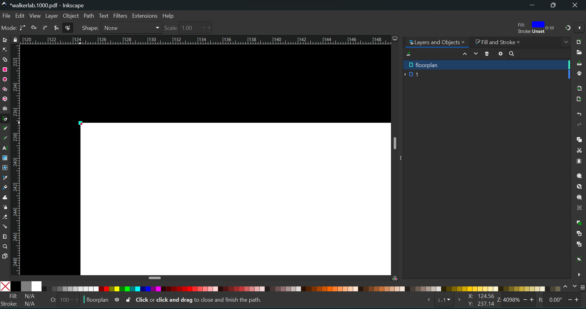
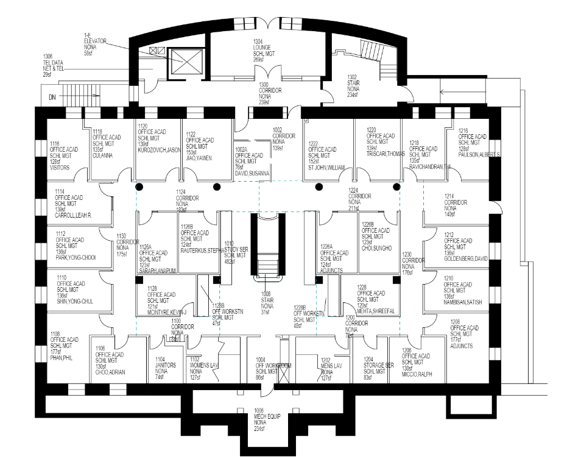

# Creating Floor Plans
We will be turning the floor plans into Scalable Vector Graphics (SVG) to allow for user interaction, css styling, and scalability. Before we create a floor plan, let us download one of the following programs:

**Free**
- [GIMP](https://www.gimp.org/)
- [Inkscape](https://inkscape.org/)

**Purchase**
- [Affinity Designer](https://affinity.serif.com/en-us/designer/)
- [Adobe Illustrator](https://helpx.adobe.com/illustrator/get-started.html)

For this tutorial, we will use Inkscape, but similar vector capabilities are provided in all programs listed. 

## 1. Obtain the floor plan
After choosing a building to work on, let us select a floor plan from these [QuACS PDFs](https://github.com/quacs/quacs-data/tree/5330bf53a2a553acfaee0ed7d03067b707464ce4/floor_plans). When choosing a floor, start with one that has the largest perimeter. By starting with the largest one, the following floors you create will be easier to align. It is best practice that one person finishes a whole building for design consistency.

## 2. Open the image
Launch your program, click on **'File'** from the menu, then select **'Open'**. Navigate to the location where your floor plan pdf is saved, select it, and click Open.

## 3. Trace inner rooms and outer floor
First, create a new layer to work on so that we are not directly editing the pdf layer (this will help us later when just exporting our traced floor).

Any room that is labeled with an id we will capture in the floor plan (stay away from capturing staircases). Use the pen tool with the paraxial line segment option selected (this will create 90 degree angles for square rooms; you can also hold `Ctrl` to do achieve this), zoom in on the first corner of a room and carefully select it.

I suggest watching [this video](https://www.youtube.com/watch?v=ijZlMHJJ0F0&ab_channel=LogosByNick) if you have a unique wall that you cannot trace with just right angles (curved walls, etc).

Do the same with the second corner, and from there Inkscape should only make perpendicular lines to the one you created, making it easy to finish up the room by clicking on the other corners and then finally connecting it to the first one.

If your room is now filled in black from the path, you can easily change the color to make it stand out and change the opacity on the bottom left of the screen. Then, press `Shift + Ctrl + X` (or go to `Edit -> XML Editor`) and rename the `id` tag to the room number preceded by a `_`. FYI, just renaming the label (by double clicking the name and renaming it to `_room#` for example) will add a tag called `inkscape_label` and not actually change the `id` tag that we need.

Some rooms don't have numbers but are essential in the foundation of the building or the shape of the floor. These rooms can be given the `id=unexcavated#` where `#` is replaced with an integer starting at 1 and increasing with every extra room of this kind (see `Sage1.svg` for example).

Tracing the outer floor is the same process as the inner floors. Make sure to trace the outer most wall and rename the `id` tag to `floor`. Also, try to capture the parts of the floor that have valid rooms in them (eg. some parts of a floor can be left out if they dont connect rooms).

Lastly, make sure to open the XML Editor again and delete every attribute from each of the paths except for `id` and `d` (this gets rid of the coloring and extra attributes).

## 4. Export SVG and Clean it up
Once finished with the floor plan, make sure to delete the first layer with the pdf to leave the paths we created. Right click on the layer with our paths, click `Convert to group`, then right click again and click `Ungroup` to get rid of the outer shell and leave just our paths.

Then, press `Shift + Ctrl + E` or `File -> Export`, make sure it is exported as an SVG, and rename it as `abbrev#` where the abbreviation is established in `data\convert.py`.

Once exported, open this [SVG minimizer](https://svgomg.net/) to condense the svg and remove all of the redundant elements put in by Inkscape.

Make sure to set the precision slider to 0, uncheck `Clean up ids` and to check `Prefer viewbox to width/height` and `Prettify markup`. The rest shouldn't really matter for our case.

Finally, download the resulting SVG, and move it to the `Vacansee\app\src\assets\floors` folder. We are not done cleaning it up yet, however. Now, open the svg in VS Code (or any code editor) and delete any parts of the svg that are not the paths or the svg tag. If the resulting svg does not look the same as before, you may have deleted an essential component (like a group tag if you didn't properly ungroup the paths before you exported). Here's the before and after that should look similar to what you do:

