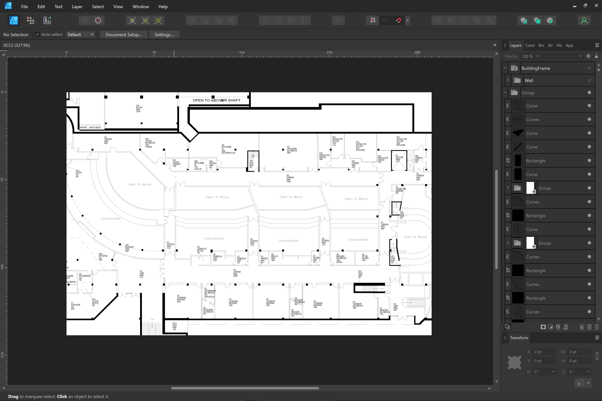
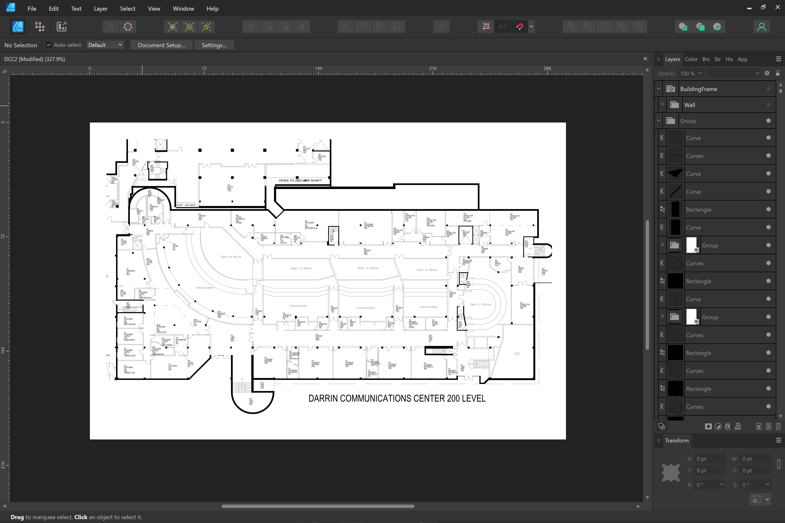
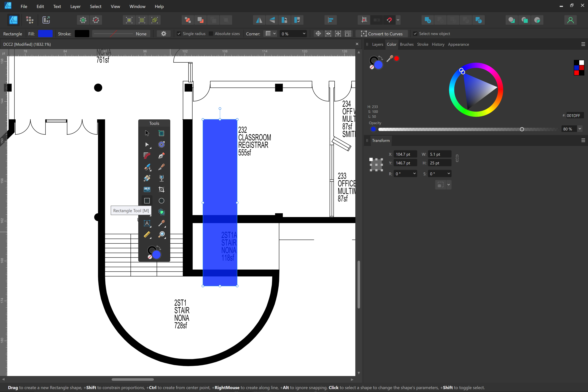
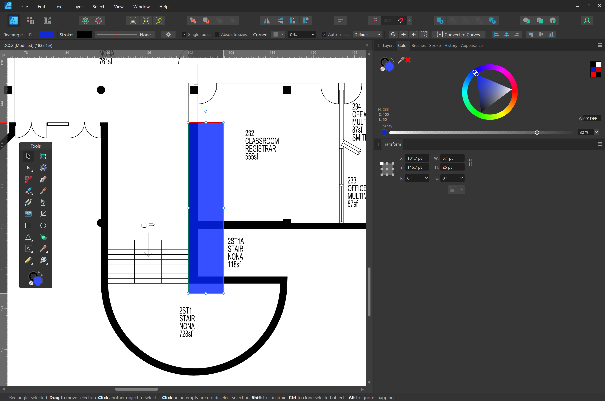
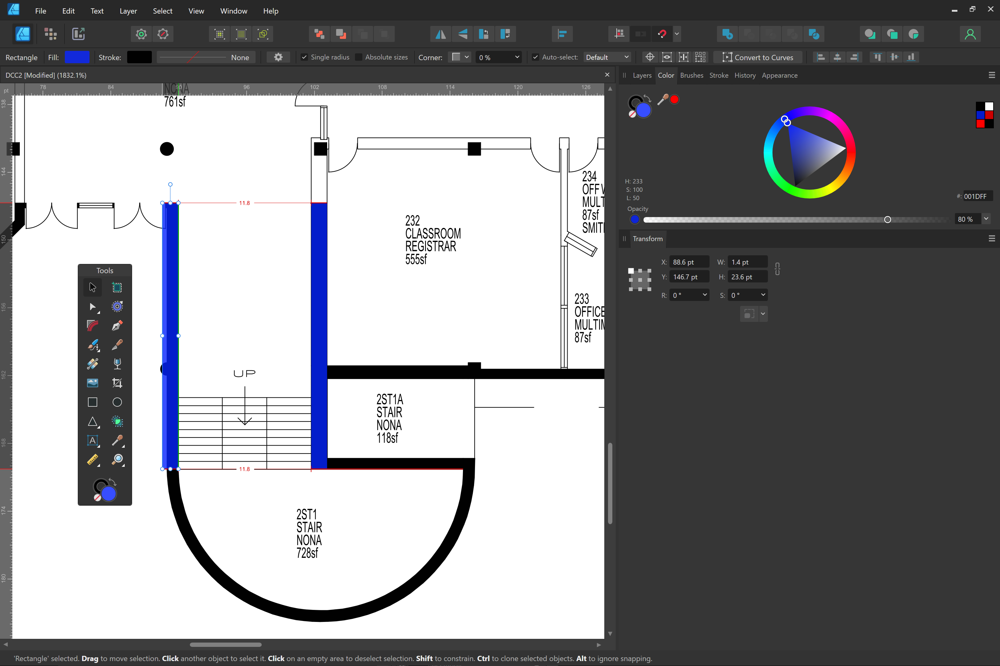
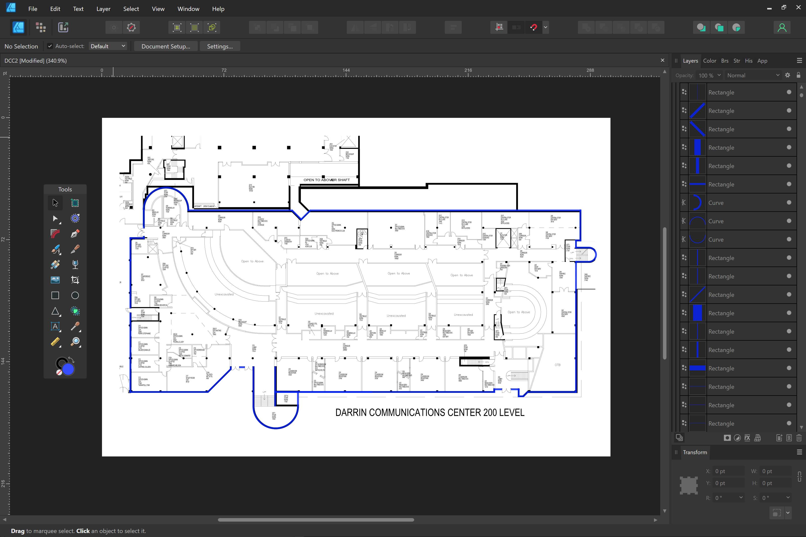

# Creating Floor Plans
We will be turning the floor plans into Scalable Vector Graphics (SVG) to allow for user interaction, css styling, and scalability. Before we create a floor plan, let us download one of the following programs:

**Free**
- [GIMP](https://www.gimp.org/)
- [Inkscape](https://inkscape.org/)

**Purchase**
- [Affinity Designer](https://affinity.serif.com/en-us/designer/)
- [Adobe Illustrator](https://helpx.adobe.com/illustrator/get-started.html)

For this tutorial, we will use Affinity Designer, but similar vector capabilities are provided in all programs listed. 

## 1. Obtain the floor plan
After choosing a building to work on, let us select a floor plan from these [QuACS PDFs](https://github.com/quacs/quacs-data/tree/5330bf53a2a553acfaee0ed7d03067b707464ce4/floor_plans). When choosing a floor, start with one that has the largest perimeter. By starting with the largest one, the following floors you create will be easier to align. It is best practice that one person finishes a whole building for design consistency.

## 2. Open the image
Launch your program, click on **'File'** from the menu, then select **'Open'**. Navigate to the location where your floor plan pdf is saved, select it, and click Open.

## 3. Resize the canvas
It is good practice to keep the canvas small for easier use. The largest dimension of height or width can be between 100 to 500 pixels. To change the canvas size, click on **'File'** from the topbar, then select **'Document Setup'**. In my example, I will choose 300 x 200.

As seen, my image is too large for the dimension. First we need to select all our floor plan elements. I can either click on the screen and drag a select square over the entire picture, or click on the layers menu, and press `CTRL`+`A`. Once selected, I `SHIFT`+click a corner maintain the aspect ratio and shrink the image down. 

Center the image for sake of neatness.

## 4. Trace the outer walls
Let us create a semi-transparent rectangle in blue so we can find where we are working.

If you double-click on the original floor plan, your program will detect that it should be considered for alignment. Let us go back and select our blue rectange again to align it to the floor plan.

As seen in the photo, there is a red and green alignment bar to suggest it snapped. Now resize the rest of the rectangle to be aligned. 

Let us copy `CTRL`+`C` and paste `CTRL`+`V` our rectangle and align it the next wall.

As you can see, the wall we created is slightly too large. That is intential, as it does not change our ability in interpretting the map, and makes viewing the map easier on the eyes. When we have many thicknesses, it distracts the user from their primary objective of finding paths/rooms. Let us use this same thickness for the entire border.

Now we have completed lining the walls. Note that we did not cover door entrances. Let us group all our work by `SHIFT`+clicking the bottom curve in our layers list and the top curve of our layers list. Right click your selection and press group. Feel free to name your grouping.

## 5. Creating inner walls
To be completed
